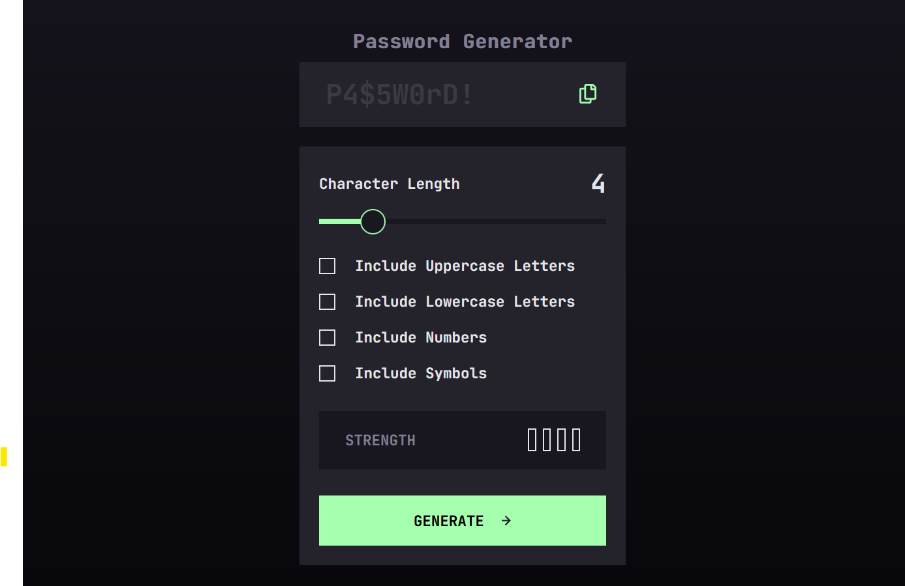

# Frontend Mentor - Password generator app solution

This is a solution to the [Password generator app challenge on Frontend Mentor](https://www.frontendmentor.io/challenges/password-generator-app-Mr8CLycqjh). Frontend Mentor challenges help you improve your coding skills by building realistic projects.

## Overview

### The challenge

Users should be able to:

- Generate a password based on the selected inclusion options
- Copy the generated password to the computer's clipboard
- See a strength rating for their generated password
- View the optimal layout for the interface depending on their device's screen size
- See hover and focus states for all interactive elements on the page

### Screenshot

### Links

- Solution URL: [Github Repository](https://www.github.com/okayishmael/password-generator-app)
- Live Site URL: [Live github page](https://okayishmael.github.io/password-generator-app)

## My process

### Built with

- Semantic HTML5 markup
- CSS custom properties
- Flexbox
- CSS Grid
- Mobile-first workflow

### What I learned

I am 2.5 months into practicing JavaScript daily. This project was a little advanced for me. I sorted out other people who completed the project but got only some understanding of what was going on. I rewrote their code, line for line to walk myself through what was going on instead of just copying.

The project is what in my learning path for me to complete inorder to move the next step. Though I don't have full understanding of the subject matter and have no one to explain to me, I have to submit to move on to the next challenge.

As the saying goes "Never use code you don't understand". I understand some but like I said, I have to move to what's next. I hope to reach to the level in learning that fully covers the subject matter at Codecademy.com

### Continued development

My current focus is JavaScript and it my first coding language apart from HTML and CSS.

## Author

- Website - [My Linkedin](https://www.linkedin.com/in/ishmael-sunday)
- Frontend Mentor - [@okayishmael](https://www.frontendmentor.io/profile/okayishmael)
- Portfolio - [Graphic Design](https://github.com/okayishmael/Ishmael-Sunday-design-portfolio)

**Note: Delete this note and add/remove/edit lines above based on what links you'd like to share.**

## Acknowledgments

[Isaiah Repository](https://github.com/Isaiah-B/Password-Generator-Frontend-Mentor)
